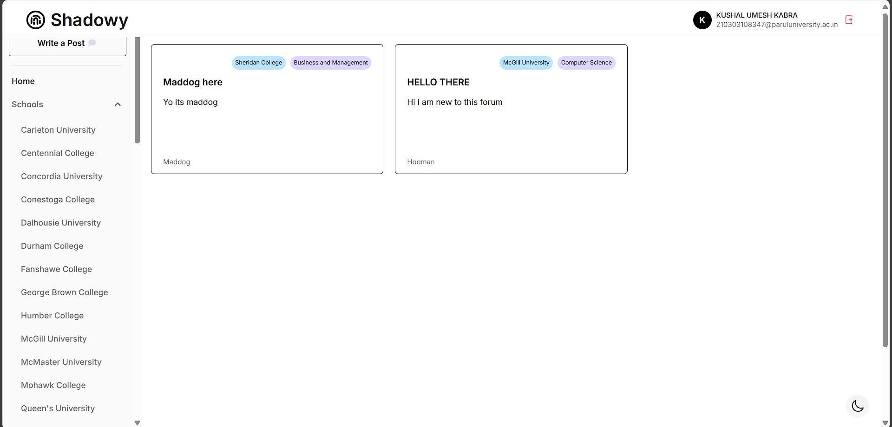
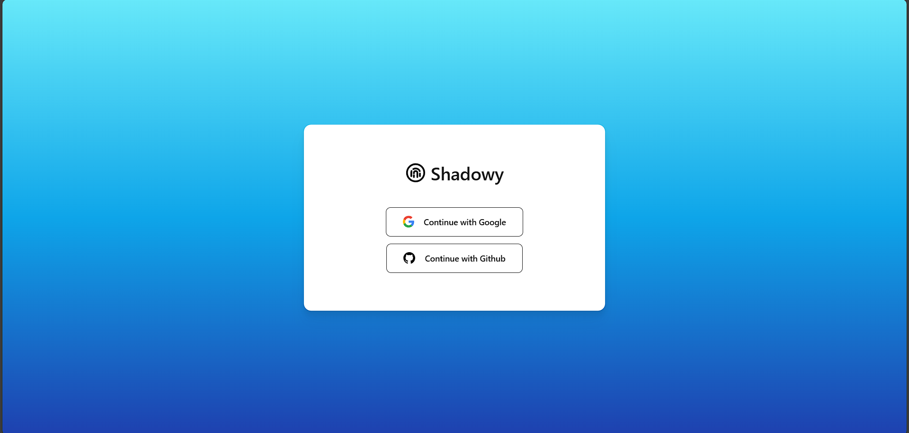
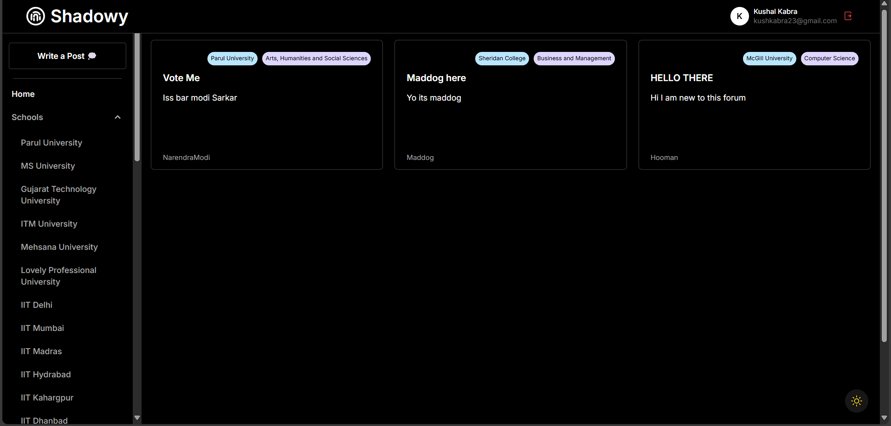
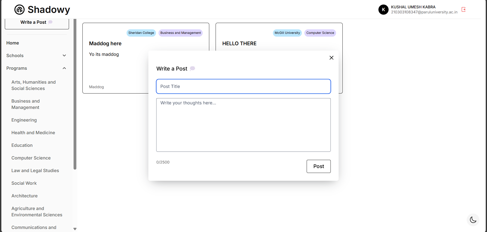
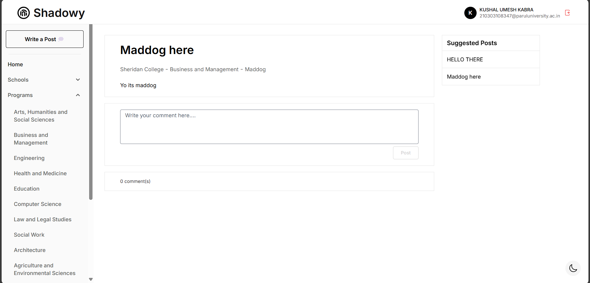

# Shadowy - Anonymous School/Program Discussion Web App
Shadowy is a web application built using Next.js, Tailwind CSS, Radix UI, React Context, OAuth, and Prisma. It serves as a platform for users to discuss school or program-related topics anonymously, much like apps like Reddit and Blind. With Shadowy, users can share their thoughts, ask questions, and engage in conversations with others.

## Screenshots

## Features

<ul>
  <li><strong>Commenting</strong>: Users can comment on posts, adding to ongoing discussions.</li>
  <li><strong>Filtering</strong>: Posts can be filtered based on criteria, such as school or program.</li>
  <li><strong>OAuth Integration</strong>: Simplified user authentication using OAuth for a seamless login experience.</li>
  <li><strong>Next.js API Routes</strong>: Leveraging Next.js API routes to handle backend logic and data retrieval.</li>
  <li><strong>Prisma ORM</strong>: Utilizing Prisma to interact with the database, making data management efficient and straightforward.</li>
  <li><strong>React Context</strong>: Implementing React Context for state management and global accessibility of certain data.</li>
  <li><strong>Responsive Design</strong>: Ensuring a smooth and consistent user experience across various devices.</li>
</ul>

   

 
 

